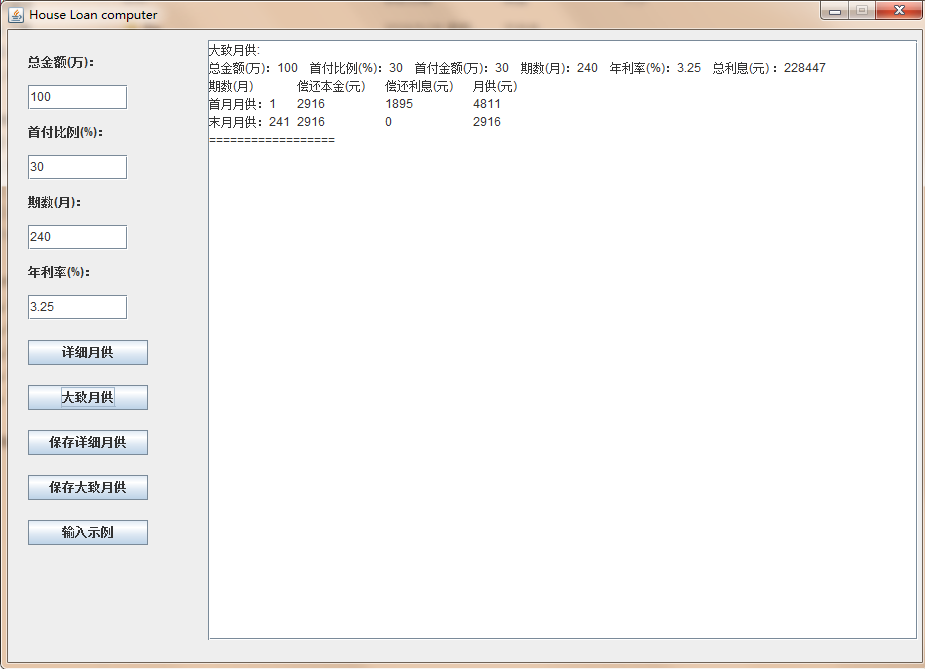
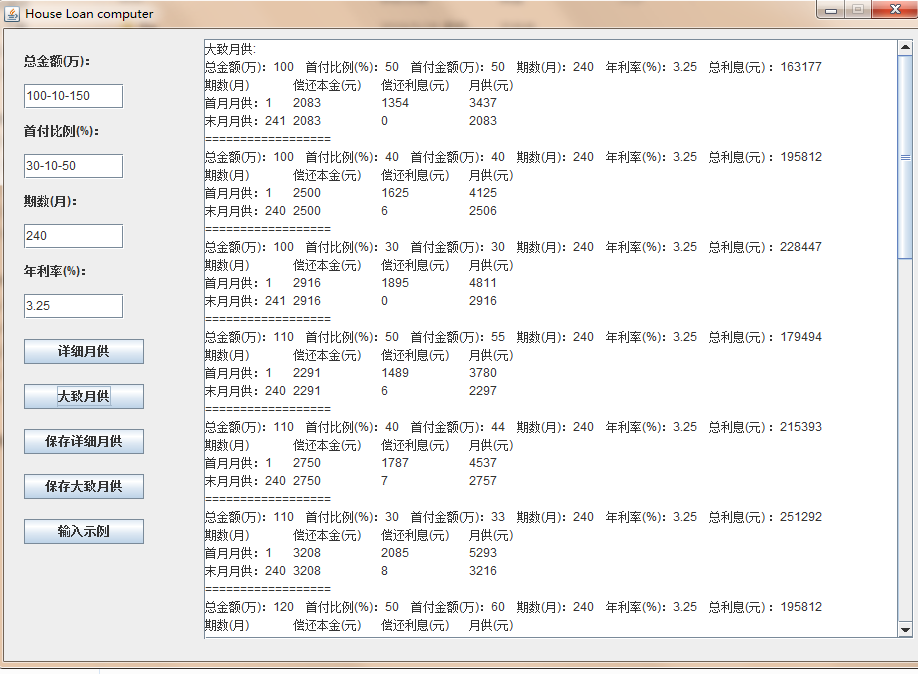

# HouseLoanComputer

这是一个**遍历式房贷计算器**：
    输入可以是一个数值，也可以是一段区间，使用该软件可以轻松遍历找到一个既能轻松生活，又能还房贷的一个贷款方式。

**计算法方式**：等额本金

**输入格式示例：**
    总金额(万)输入格式：(1) 50-2-60   (2) 60 
    首付比例输入格式：(1) 50-10-70  (2) 60
    期数输入格式：(1) 120-120-360  (2) 120

**示意图：**

